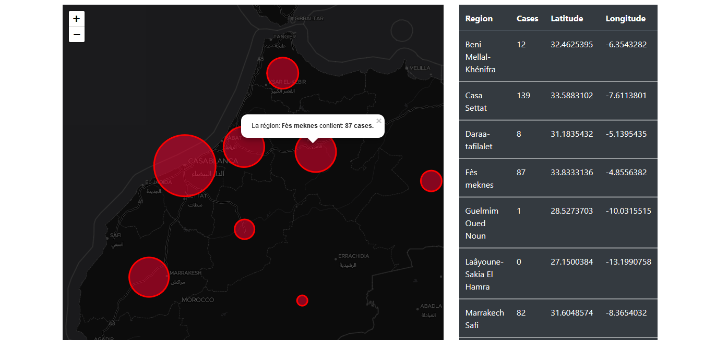

# COVIDMA-map
💥 Moroccan data about COVID19/ Live MAP 2020

# Map features :
   - The diameter of the circle changes dynamically, depending on the cases in each region.
   - This map enables you to know the details of each circle where Corona is located by clicking the mouse.
   - Zoom is automatically turned on, depending on the boundaries of the circles in the map.
   - Added Moroccan desert on The maptiler map (المغرب في صحرائه والصحراء في مغربها).
   - A dark map was used to express a human catastrophe, and also to clearly show the circles
   
# Screenshot :

# Preview MAP : 
   https://covid19-livemap.netlify.com/
   
# I used : 
  - Mr. Idder Hamouch COVIDMA JSON FILE : https://github.com/iddify
  - JAVASCRIPT .. Request ajax
  - Bootstrap
  - Maptiler

